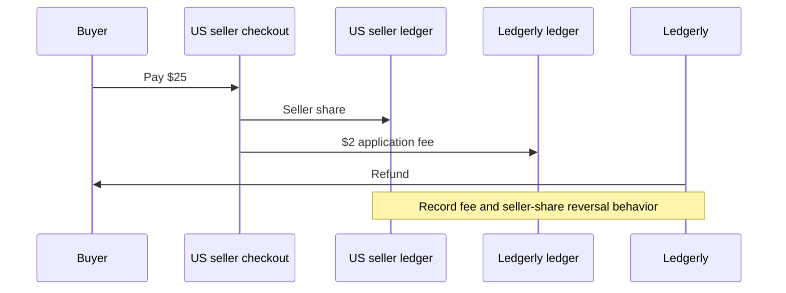
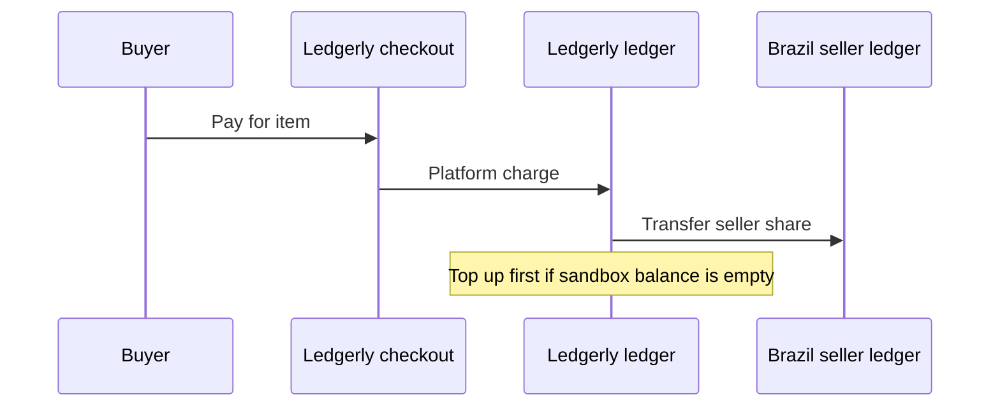

# Ledgerly × Whop platform scaffold

Minimal Node 22/TypeScript starting point for the Ledgerly Platforms FDE assessment. It runs locally, serves a health check and a future payouts page, and provides a sandbox seller seed script. Every financial route returns `501 Not Implemented`; the webhook route must not acknowledge success until signature verification and durable event persistence exist.

## Run locally

```sh
npm ci
npm run dev
```

Copy `.env.example` to `.env` to configure sandbox calls. The generic wrapper is locked to `https://sandbox-api.whop.com/api/v1/`, uses built-in `fetch`, requires `WHOP_API_KEY`, and applies a timeout. See only the [official Whop documentation](https://docs.whop.com/) before adding endpoint-specific behavior.

Available scripts: `dev`, `typecheck`, `build`, `start`, and `reconcile` (the last intentionally exits nonzero until implemented).

## Money flows to implement and prove

Direct charge ($25 with $2 application fee), then refund:



Platform charge, then transfer:



## Assessment scope checklist

- [ ] Create the Ledgerly platform plus US, Germany, and Brazil sellers; record parent/account IDs.
- [ ] Probe duplicate seller creation and attempted nesting beneath a connected account.
- [ ] Make onboarding idempotent by external ID; create/fetch using external ID, email, and country, then return an onboarding link.
- [ ] Capture seller verification, required actions, and capabilities before/after onboarding.
- [ ] Compute and validate the 8% application fee; prove the direct $25 charge, $2 fee, refund, and resulting ledger entries.
- [ ] Prove a platform charge and transfer to the Brazil seller (including top-up if required).
- [ ] Embed payouts with short-lived, explicitly scoped access; demonstrate portal fallback and one rail's fee markup.
- [ ] Configure child events for payment succeeded/failed, refund, dispute, transfer completed, payout created/updated, and account updated; capture each payload and replay a delivery.
- [ ] Suspend a seller and create a least-privilege key scoped to one connected account.
- [ ] Implement durable event-id idempotency across restarts, signature verification before acknowledgement, and seller routing.
- [ ] Reconcile one seller's Whop payments/transfers against a durable local ledger.
- [ ] Complete the missing-account/payout-event/pending-withdrawal debug answers and three product/docs improvements.
- [ ] Add final IDs and screenshots/recordings to `docs/evidence.md`; provide written answers and Loom.
- [ ] Send the sandbox business ID to the recruiter for platform enablement.
- [ ] Reconcile the current private-repository preference with the assessment's public-repository submission requirement before submitting.

Templates live in [`docs/answers.md`](docs/answers.md) and [`docs/evidence.md`](docs/evidence.md).

## Step 1: reproducible seller setup

Set `WHOP_PLATFORM_COMPANY_ID=biz_BC8sRG36RkIpHk`, your sandbox `WHOP_API_KEY`, and `SEED_SELLER_EMAIL` in the ignored `.env`. `SEED_SELLER_EMAIL` must be a mailbox you control: Whop rejects addresses that cannot receive mail, even in sandbox (see [`docs/evidence.md`](docs/evidence.md)). `SEED_SELLER_EMAIL_US`, `SEED_SELLER_EMAIL_DE`, `SEED_SELLER_EMAIL_BR`, and `SEED_SELLER_EMAIL_NESTED` optionally override individual accounts, for example with plus-addressed variants of one inbox. An applied run validates every address it might submit before sending any request, and refuses reserved domains such as `example.com` locally. The platform and key are created manually. For this script, select `company:create_child` and `company:basic:read` in the sandbox key UI; balance-read is not used here.

```sh
npm run seed:sellers                  # Preview; no key or network required
npm run seed:sellers -- --apply       # List all children, reuse or create US/DE/BR
npm run seed:sellers -- --apply --probe # Also repeat US creation and attempt nesting
```

The three payloads include `parent_company_id`, the configured receiving `email` (the preview prints the resolved address, or `<SEED_SELLER_EMAIL>` when unset), and stable `metadata.external_id`. Country codes are stored as descriptive metadata, not verified legal/payout country. Complete real country selection through onboarding; this seed alone does not prove country eligibility. See [Whop enrollment](https://docs.whop.com/developer/platforms/enroll-connected-accounts) and [company listing](https://docs.whop.com/api-reference/companies/list-companies).

Each applied run saves HTTP statuses, selected response fields, requests (including the configured email addresses), IDs, and errors under ignored `evidence/seed-sellers/`. Evidence is saved after each response and on failure. Inspect and summarize results in `docs/evidence.md`; do not commit credentials or unreviewed exports. No automatic POST retries occur. A network timeout can still leave an account created remotely: inspect the sandbox before retrying.

Reuse is a serial lookup by external ID, not server-enforced idempotency. Run only one seed process at a time. Existing sellers with different external IDs will not match: inspect and adjust the fixtures before applying to a populated sandbox. Multiple matches stop the script. The duplicate probe deliberately bypasses lookup and can create an extra account; it records whether the returned ID matches. The nested probe records the exact API error and flags unexpected success or non-422 failures. A 422 still needs inspection to confirm it is specifically the nesting error. `complete` means the script finished, not that all assessment requirements were verified.

## Step 3: two money flows

`scripts/money-flows.ts` uses the existing sandbox client and `.env` key. Writes preview by default; add `--apply` to execute. The fixed amounts are $25 per item, $2 application fee for direct charges, and $23 for transfers (before processing fees).

```sh
npm run money -- inspect biz_BC8sRG36RkIpHk
npm run money -- inspect biz_q5tPMk6MCfoLOm
npm run money -- checkout direct order-us-1 --apply
```

Open the printed checkout URL and pay with sandbox card `4242 4242 4242 4242`, a future expiry, and any three-digit CVC. Find the payment ID in the seller's dashboard or `inspect` output, then:

```sh
npm run money -- inspect biz_q5tPMk6MCfoLOm pay_REPLACE
npm run money -- inspect biz_BC8sRG36RkIpHk
npm run money -- refund pay_REPLACE --apply
npm run money -- inspect biz_q5tPMk6MCfoLOm pay_REPLACE
npm run money -- inspect biz_BC8sRG36RkIpHk
npm run money -- checkout platform order-br-1 --apply
```

Pay the platform checkout separately. Check Ledgerly's available balance in the sandbox dashboard and the Brazilian seller's transfer capability with `inspect`. Top up in the sandbox dashboard if necessary; a pending payment is not available cash. Replace `biz_BRAZIL` below with the seeded Brazilian seller ID:

```sh
npm run money -- inspect biz_BRAZIL
npm run money -- transfer biz_BRAZIL order-br-1 --apply
npm run money -- inspect biz_BC8sRG36RkIpHk
npm run money -- inspect biz_BRAZIL
```

Reuse the same order reference on retries. Whop's idempotency key prevents duplicate operations only within its **24-hour retention period**; changing the order creates a new operation. The script also keeps an order-indexed record under ignored `evidence/money-flows/operations/`: once an ID is known, reruns retrieve that operation instead of creating another, even after 24 hours. An unresolved attempt older than 24 hours stops without sending a POST. Reconcile it in the sandbox and record the confirmed ID in the indicated file before rerunning; do not delete the record or change the order to bypass uncertainty. A failed retrieval also stops without creating a replacement. Keep this directory across runs and use the same worktree; operations made before these records existed require manual reconciliation before reuse. The internal start time controls retry safety and is not included in redacted ledger evidence.

Refund keys are derived from the payment ID and use the same local tracking. An operation lock prevents simultaneous requests for the same order; after a crash, check that no process is active before removing the indicated lock file. The script does not retry requests automatically or assert settlement from a successful HTTP response. A transfer is separately triggered and does not check whether its order was paid; inspect payment success first. It trusts the supplied Brazilian account ID, so verify it before applying.

`scripts/money-contracts.ts` defines the fields this helper sends and consumes using Whop's [native OpenAPI schema](https://docs.whop.com/openapi/api-v1-native.json). These are focused contracts, not complete API models or runtime schema validation. The checkout's inline `product` and `application_fee_amount` follow the assessment; they are absent from the published native checkout schema. Raw response fields still pass through the existing evidence allowlist. See [Whop's retry rules](https://docs.whop.com/developer/api/idempotency).

Each executed command saves selected financial fields without identity details, checkout URLs, or timestamps under ignored `evidence/money-flows/`. `inspect` reads all ledger pages, optionally retrieves a `pay_` or `tr_` resource, and preserves API amount units without conversion. Match activity by resource ID; do not sum unrelated history or assume fees are refunded. Summarize payment/refund/transfer IDs and actual ledger changes in `docs/evidence.md`. No Step 3 payment has been executed merely by adding this helper.

References: [money flows](https://docs.whop.com/developer/platforms/collect-payments-for-connected-accounts), [financial activity](https://docs.whop.com/api-reference/beta/ledgers/list-financial-activity), [refunds](https://docs.whop.com/api-reference/beta/payments/refund-payment), [sandbox cards](https://docs.whop.com/developer/guides/sandbox).
