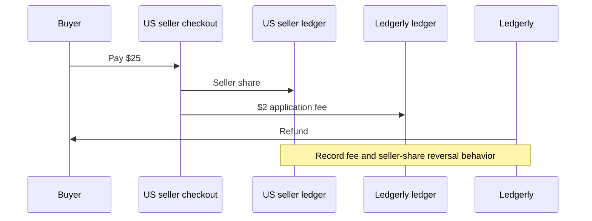
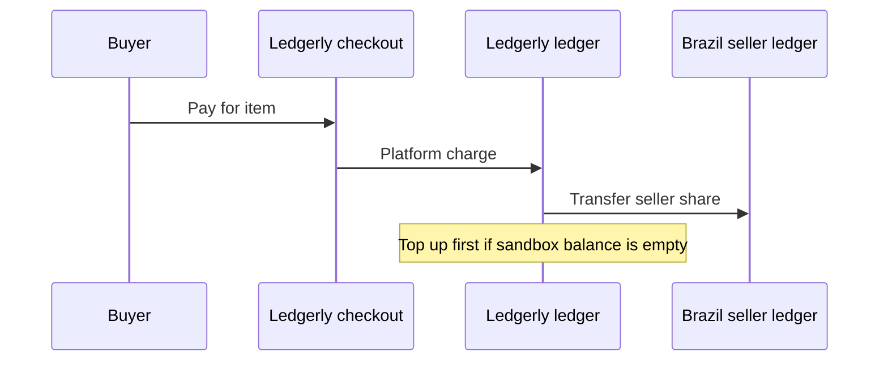

# Ledgerly × Whop platform scaffold

Minimal Node 22/TypeScript starting point for the Ledgerly Platforms FDE assessment. It runs locally, serves a health check and a future payouts page, and deliberately performs **no** account, payment, payout, or webhook business logic yet. Every financial route returns `501 Not Implemented`; the webhook route must not acknowledge success until signature verification and durable event persistence exist.

## Run locally

```sh
npm ci
npm run dev
```

Copy `.env.example` to `.env` only when sandbox calls are implemented. The generic wrapper is locked to `https://sandbox-api.whop.com/api/v1/`, uses built-in `fetch`, requires `WHOP_API_KEY`, and applies a timeout. See only the [official Whop documentation](https://docs.whop.com/) before adding endpoint-specific behavior.

Available scripts: `dev`, `typecheck`, `build`, `start`, and `reconcile` (the last intentionally exits nonzero until implemented).

## Money flows to implement and prove

Direct charge ($25 with $2 application fee), then refund:



Platform charge, then transfer:



## Assessment scope checklist

- [ ] Create the Ledgerly platform plus US, Germany, and Brazil sellers; record parent/account IDs.
- [ ] Probe duplicate seller creation and attempted nesting beneath a connected account.
- [ ] Make onboarding idempotent by external ID; create/fetch using external ID, email, and country, then return an onboarding link.
- [ ] Capture seller verification, required actions, and capabilities before/after onboarding.
- [ ] Compute and validate the 8% application fee; prove the direct $25 charge, $2 fee, refund, and resulting ledger entries.
- [ ] Prove a platform charge and transfer to the Brazil seller (including top-up if required).
- [ ] Embed payouts with short-lived, explicitly scoped access; demonstrate portal fallback and one rail's fee markup.
- [ ] Configure child events for payment succeeded/failed, refund, dispute, transfer completed, payout created/updated, and account updated; capture each payload and replay a delivery.
- [ ] Suspend a seller and create a least-privilege key scoped to one connected account.
- [ ] Implement durable event-id idempotency across restarts, signature verification before acknowledgement, and seller routing.
- [ ] Reconcile one seller's Whop payments/transfers against a durable local ledger.
- [ ] Complete the missing-account/payout-event/pending-withdrawal debug answers and three product/docs improvements.
- [ ] Add final IDs and screenshots/recordings to `docs/evidence.md`; provide written answers and Loom.
- [ ] Send the sandbox business ID to the recruiter for platform enablement.
- [ ] Reconcile the current private-repository preference with the assessment's public-repository submission requirement before submitting.

Templates live in [`docs/answers.md`](docs/answers.md) and [`docs/evidence.md`](docs/evidence.md).
