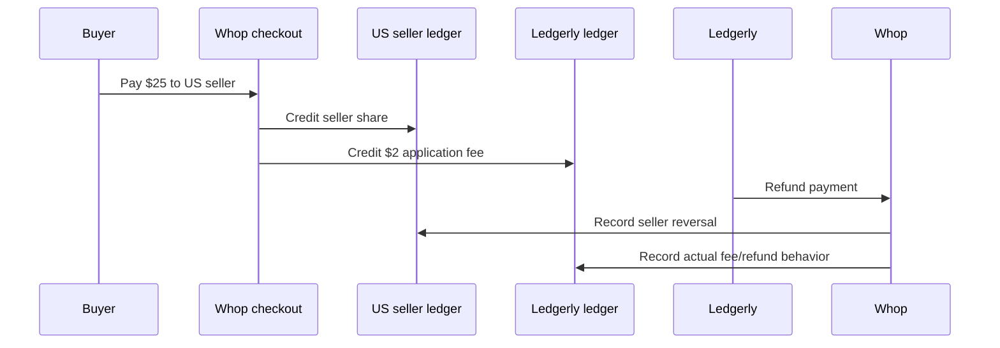
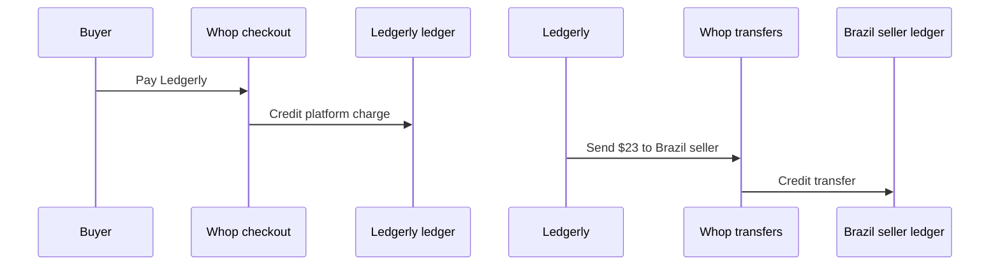

# Ledgerly × Whop Platforms

Ledgerly is a sandbox reference for a marketplace built on Whop connected accounts. It includes authenticated seller onboarding, 8% direct-charge checkout, embedded and hosted payouts, durable Standard Webhooks ingestion, platform operations, and read-only reconciliation.

## Quick start

Requires Node 22. The durable store uses Node's built-in SQLite API.

```sh
npm ci
cp .env.example .env
npm run dev
```

Open http://127.0.0.1:3000. Enter the token from one configured `LEDGERLY_SELLER_SESSIONS` entry; the browser uses it only as a Bearer credential to the local server. The Whop API key is never returned to the browser.

Use sandbox credentials only. `LEDGERLY_PUBLIC_URL` must be an HTTPS tunnel/origin because Whop account-link return URLs do not accept localhost. The generic API client is locked to `https://sandbox-api.whop.com/api/v1/`, rejects redirects, and times out.

## Configuration and scopes

`.env.example` documents every variable. `LEDGERLY_SELLER_SESSIONS` is a local-demo JSON mapping from long random session tokens to server-owned `external_id`, email, and two-letter country metadata. Request bodies cannot choose another seller. Replace this static mapping with real application sessions before production.

Grant the platform key only the actions exercised:

- connected accounts/onboarding: `company:create_child`, `company:basic:read`;
- checkout: `checkout_configuration:create`, `checkout_configuration:basic:read`;
- payout token/portal: `company:balance:read`, `payout:withdraw_funds`, `payout:withdrawal:read`, `payout:destination:read`, `payout:create_destination`;
- reconciliation: `payment:basic:read`, `payout:transfer:read`;
- operations as needed: `developer:manage_webhook`, `company:suspend_child`, `developer:manage_api_key`, `company:update_child_fees`.

`WHOP_WEBHOOK_SECRET` is the `whsec_` Standard Webhooks secret, not the platform API key.

## Seller HTTP flow

All seller routes require `Authorization: Bearer <seller-session-token>`.

```sh
curl -X POST https://YOUR-TUNNEL/api/onboarding -H 'Authorization: Bearer SESSION'
curl -X POST https://YOUR-TUNNEL/api/checkout \
  -H 'Authorization: Bearer SESSION' -H 'Content-Type: application/json' \
  -d '{"order_id":"order-1001","amount_minor":2500,"currency":"usd","title":"Acme Preset Pack"}'
```

Onboarding lists every child-account page and reuses one exact `metadata.external_id` match. Email and country metadata mismatches stop with 409. Before creating, SQLite records a guarded attempt and sends a stable provider idempotency key; concurrent, crashed, or network-ambiguous attempts do not issue another create until a later listing reveals the account. The country value is descriptive metadata, not proof of legal or payout country.

Checkout accepts integer minor units and computes the fee with integer arithmetic (`2500 → 200`). It verifies the locally bound account still appears under the configured platform, records the order fingerprint before POST, sends an idempotency key, and retrieves the known checkout on exact retry. The connected account is bound in `plan.company_id`, and inline products use the order ID as a stable external identifier. An unresolved attempt stops instead of risking a second checkout. Whop validation errors are returned as `provider` errors; a URL is never fabricated.

The inline-plan request follows Whop's current checkout schema and official Masterclass example. In this sandbox, an earlier assessment-shaped request produced a conflicting `company_id` validation error. That historical provider/schema blocker is not evidence of a checkout; validate the corrected request in an enabled sandbox rather than claiming success from the local implementation.

## Payouts

The seller dashboard uses [Tabler](https://docs.tabler.io/ui/getting-started/installation), pinned to 1.5.1 with stylesheet integrity verification. Its responsive cards contain the Whop controls; the stylesheet requires access to jsDelivr. No Tabler JavaScript or frontend build is needed.

The root page mounts Whop's official `BalanceElement`, `WithdrawButtonElement`, and `WithdrawalsElement` in sandbox mode. Its token callback calls `POST /api/payout-token`, so the 10-minute token refreshes without exposing the platform key. Loading and provider errors are visible. `POST /api/payout-portal` creates a time-limited `payouts_portal` fallback.

Configure a crypto-withdrawal markup (preview first):

```sh
npm run operations -- markup crypto biz_SELLER 2.5
npm run operations -- markup crypto biz_SELLER 2.5 --apply
```

This uses the supported `crypto_withdrawal_markup` rail. Inspect existing markups before applying in a populated sandbox; the CLI intentionally does not auto-delete or replace them.

## Webhooks and durable ledger

Create one platform webhook with child events and the eight assessment events:

```sh
npm run operations -- webhook create https://YOUR-TUNNEL/api/webhook
npm run operations -- webhook create https://YOUR-TUNNEL/api/webhook --apply
npm run operations -- webhook test hook_WEBHOOK payment.succeeded
npm run operations -- webhook test hook_WEBHOOK payment.succeeded --apply
npm run operations -- webhook replay hook_WEBHOOK DELIVERY_ID
npm run operations -- webhook replay hook_WEBHOOK DELIVERY_ID --apply
```

The consumer reads at most 1 MiB, verifies the exact raw body with Standard Webhooks' five-minute timestamp tolerance, and only then parses it. A SQLite transaction inserts the unique provider event ID and its ledger effect together. Duplicate IDs return success without posting twice. Underscore aliases normalize to dotted names, and `withdrawal.*` normalizes to `payout.*`; resource-level uniqueness prevents alias events from double-posting. Status ranks prevent late pending events from replacing terminal state.

Routing recognizes envelope `account_id`/`company_id` and data account identifiers. Transfers prefer a known connected destination, then origin, so platform-to-seller transfers land in the recipient's ledger. This reference stores one seller entry per transfer; transfers between two connected sellers would need separate debit and credit entries. Unknown sellers and payloads without a stable resource ID are durably recorded with an explicit processing status but do not mutate the ledger. Persistence failure returns 503, causing Whop to retry. SQLite provides restart durability for one local instance; production needs managed backups, encryption/access controls, and a shared database when horizontally scaled.

## Operations

Every operation is a JSON preview unless `--apply` is present:

```sh
npm run operations -- account suspend biz_SELLER
npm run operations -- key create biz_SELLER
```

The per-seller key policy grants read-only account/payment/payout actions and limits its statement resources to the chosen `biz_` ID. Whop requires a user session for API-key creation, so `key create --apply` additionally requires `WHOP_USER_TOKEN`; an Account API key cannot perform that operation. The one-time secret is never logged: it is saved with mode 0600 under ignored `evidence/api-keys/`, while stdout is redacted. Suspension and key creation are provider writes; use `--apply` only after reviewing the preview. Webhook delivery replay preserves the original webhook ID (`regenerate_id: false`) to exercise consumer deduplication.

## Reconciliation

```sh
npm run reconcile -- --seller biz_SELLER
npm run reconcile -- --seller biz_SELLER --db data/ledgerly.sqlite
```

The job opens SQLite read-only, independently fetches every page of seller payments plus sent and received transfers, deduplicates remote transfers, and compares ID, integer minor-unit amount, currency, and status. Output is deterministically sorted. Exit 0 means no differences, 2 means differences, and 1 means invalid input/read/provider failure. It never replaces local evidence with fetched data.

## Reproducible sandbox helpers

```sh
npm run seed:sellers
npm run seed:sellers -- --apply
npm run seed:sellers -- --apply --probe
npm run money -- inspect biz_ACCOUNT
npm run money -- checkout direct order-us-1
```

Both helpers preview writes by default. Seller seeding lists all children and reuses stable external IDs. `--probe` can intentionally create a duplicate and must be used only for assessment evidence. Money operations preserve order-indexed retry records under ignored `evidence/money-flows/operations/`; unresolved attempts older than Whop's 24-hour idempotency window refuse another POST. See command `--help` and inspect previews before any `--apply`.

## Money-flow diagrams





## Evidence and limitations

No payments, refunds, transfers, webhook writes, suspensions, API keys, or fee markups are executed by installing this repository. The only currently recorded live result is the already-completed US onboarding read in `docs/evidence.md`. Platform enablement is not confirmed, and the remaining IDs, screenshots, payloads, and money-flow proof must come from reviewed sandbox runs. Mocks or locally signed events prove local behavior only, never provider delivery.

This reference has no production identity provider, distributed lock/database, secret manager, observability, backup policy, or public deployment. Do not publish private assessment exports, account links, session tokens, or raw evidence. Resolve the assessment's public-repository requirement with the repository owner before changing visibility.
